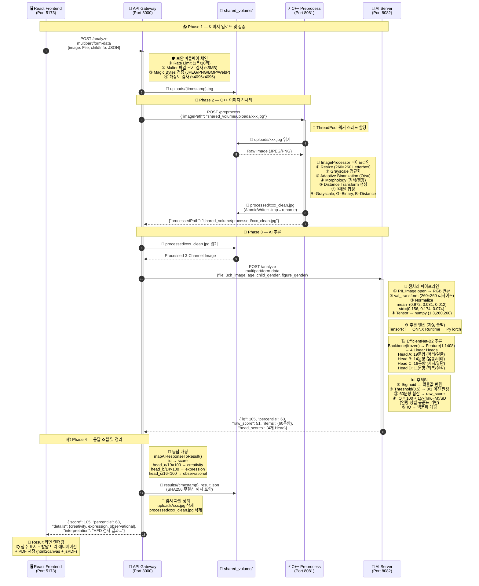
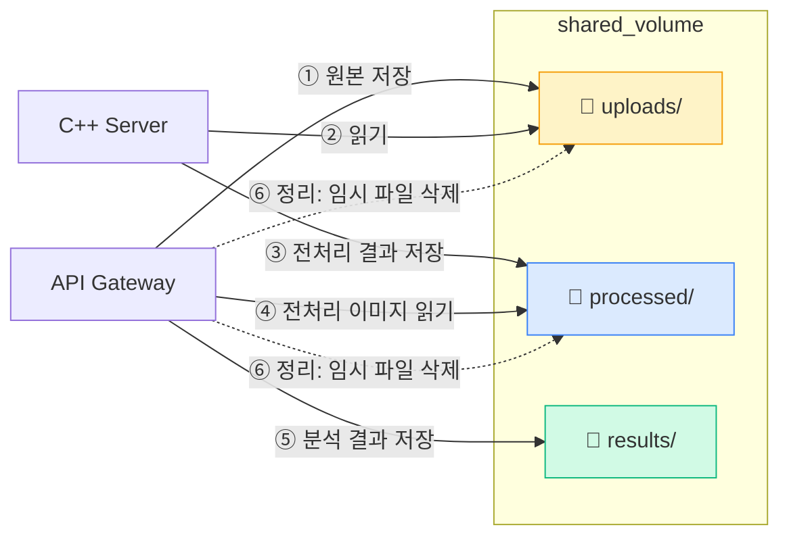

# Mind Palette

**아동 인물화(HFD) 기반 지능 측정 AI 시스템**

아동이 그린 인물화(Human Figure Drawing) 이미지를 AI로 분석하여 발달 지능(IQ)과 백분위를 산출하는 마이크로서비스 시스템입니다.

---

## 목차

- [프로젝트 개요](#프로젝트-개요)
- [시스템 아키텍처](#시스템-아키텍처)
- [서비스 구성](#서비스-구성)
- [데이터 흐름](#데이터-흐름)
- [API 명세](#api-명세)
- [시작하기](#시작하기)
- [테스트](#테스트)
- [개발 현황](#개발-현황)

---

## 프로젝트 개요

HFD(Human Figure Drawing) 검사는 아동의 손 그림을 통해 발달 지능을 측정하는 심리 검사입니다. Mind Palette는 이 검사를 자동화하여, 이미지를 업로드하면 AI가 60개 세부 문항을 채점하고 연령별 표준화된 IQ 점수와 백분위를 반환합니다.

**핵심 특징**

- 고성능 C++ 이미지 전처리 → GPU 가속 AI 추론 파이프라인
- 3채널 하이브리드 입력 (Grayscale + Binary + Distance Transform)
- 연령·성별별 표준화 IQ/백분위 산출
- TDD 기반 개발, 33개 이상의 테스트 수트

---

## 시스템 아키텍처

```
┌─────────────────────────────────────────────────────┐
│              React Frontend  (Port 5173)             │
│   Hero → InfoForm → Guide → Upload → Result         │
└────────────────────┬────────────────────────────────┘
                     │ POST multipart/form-data
                     ▼
┌─────────────────────────────────────────────────────┐
│           Node.js API Gateway  (Port 3000)           │
│   Rate Limit · File Validation · Orchestration      │
└────────┬───────────────────────────┬────────────────┘
         │ POST /preprocess           │ POST /analyze
         ▼                           ▼
┌─────────────────┐       ┌──────────────────────────┐
│  C++ Preprocess │       │    Python AI Server       │
│  Server         │       │    (Port 8082)            │
│  (Port 8081)    │       │                          │
│  ∙ Resize       │       │  EfficientNet-B2          │
│  ∙ Grayscale    │       │  + 4 Multi-head           │
│  ∙ Binarize     │       │  + ONNX / TensorRT        │
│  ∙ Edge Detect  │       │  → IQ / Percentile        │
│  ∙ ...11 filters│       │                          │
└─────────────────┘       └──────────────────────────┘
```

**포트 맵**

| 서비스 | 포트 | 언어/프레임워크 |
|--------|------|----------------|
| Frontend | 5173 | React + Vite |
| API Gateway | 3000 | Node.js / Express |
| Preprocess Server | 8081 | C++17 / Crow |
| AI Server | 8082 | Python / FastAPI |

---

## 서비스 구성

### 1. Preprocess Server (`preprocess-server/`)

C++17로 구현한 고성능 이미지 전처리 서버입니다.

**기술 스택**

| 항목 | 내용 |
|------|------|
| 언어 | C++17 |
| 빌드 | CMake 3.15+, vcpkg (`x64-windows`) |
| REST | Crow |
| 이미지 | OpenCV 4.x |
| 로깅 | spdlog |
| 테스트 | Google Test |

**구현된 필터 (Strategy Pattern)**

| 필터 | 역할 |
|------|------|
| `resize_filter` | 260×260 리사이징 |
| `grayscale_filter` | RGB → Grayscale |
| `binarize_filter` | Otsu 자동 임계값 이진화 |
| `morphology_filter` | 침식/팽창 (노이즈 제거) |
| `denoise_filter` | 가우시안 필터 |
| `nlmeans_denoise_filter` | NL-Means 노이즈 제거 |
| `clahe_filter` | CLAHE 명암비 향상 |
| `otsu_canny_filter` | Canny 엣지 감지 |
| `invert_filter` | 이미지 반전 |
| `rgb_convert_filter` | RGB 채널 변환 |
| `hybrid_preprocess_filter` | 3채널 종합 전처리 출력 |

**인프라**
- `ThreadPool`: CPU 바운드 작업용 워커 스레드 풀 (기본 4개, `PREPROCESS_WORKERS` 환경변수로 조정)
- `AtomicWriter`: 동시 요청 시 파일 쓰기 경합 방지

---

### 2. AI Server (`ai-server/`)

EfficientNet-B2 기반 HFD 분류 추론 서버입니다.

**기술 스택**

| 항목 | 내용 |
|------|------|
| 언어 | Python 3.x |
| 프레임워크 | FastAPI |
| 딥러닝 | PyTorch, torchvision |
| 추론 최적화 | ONNX Runtime, TensorRT |
| 이미지 | OpenCV |
| 로깅 | structlog |
| 테스트 | pytest |

**모델 아키텍처 (ADR-018)**

```
Input: (1, 3, 260, 260)   ← 3채널 이미지
  ↓
EfficientNet-B2 (Frozen Backbone)
  ↓ Feature Vector: (1, 1408)
  ↓
┌──────────────────────────────────────────┐
│  Head A: 19문항  (머리/얼굴)             │
│  Head B: 14문항  (몸통/연결/비례)        │
│  Head C: 16문항  (사지/말단)             │
│  Head D: 11문항  (의복/질적)             │
└──────────────────────────────────────────┘
  Total: 60문항 → 원점수 → IQ/백분위 변환
```

**3채널 입력 의미**

| 채널 | 내용 | 역할 |
|------|------|------|
| R (CH0) | Grayscale | 명도 정보 |
| G (CH1) | Binary | 구조 정보 |
| B (CH2) | Distance Transform | 거리/두께 정보 |

**추론 백엔드 (자동 폴백)**

```
TensorRT Native (~10ms) → ONNX Runtime (~20ms) → PyTorch (~40ms)
```

---

### 3. API Gateway (`api-gateway/`)

마이크로서비스 오케스트레이터이자 클라이언트 진입점입니다.

**기술 스택**

| 항목 | 내용 |
|------|------|
| 언어 | TypeScript |
| 프레임워크 | Express.js |
| 파일 업로드 | Multer |
| HTTP 클라이언트 | Axios |
| 로깅 | Winston + Morgan |
| 테스트 | Jest + Supertest |

**처리 파이프라인**

```
1. 클라이언트 요청 수신
2. Rate Limiting (1분/10회)
3. 매직 바이트 검증 (JPEG/PNG/BMP/WebP)
4. shared_volume/uploads/ 에 파일 저장
5. → Preprocess Server 호출 (C++)
6. → AI Server 호출 (Python) + processed 이미지 전달
7. AiServerResponse → AnalysisResult 매핑
8. SHA256 무결성 해시 포함 결과 저장
9. 임시 파일 정리
10. 클라이언트 응답 반환
```

**보안**

- Rate Limiting: 전역 (15분/100회), `/analyze` (1분/10회)
- 매직 바이트 기반 파일 형식 검증
- 경로 트래버설 방지 (CodeQL 대응)
- 로그 PII 마스킹 (파일 경로 숨김)
- SHA256 결과 무결성 검증

---

### 4. Frontend (`frontend/`)

아동 정보 입력 → 이미지 업로드 → 결과 시각화 흐름의 React 앱입니다.

**기술 스택**

| 항목 | 내용 |
|------|------|
| 프레임워크 | React 18 + TypeScript |
| 빌드 | Vite |
| 스타일 | Tailwind CSS |
| 애니메이션 | Framer Motion |
| PDF | html2canvas + jsPDF |
| 테스트 | Vitest |

**6단계 사용자 흐름**

```
Hero → InfoForm → Guide → Upload → Loading → Result
```

| 단계 | 내용 |
|------|------|
| Hero | 시작 화면 |
| InfoForm | 자녀 이름·성별·생년월일 입력 |
| Guide | 인물화 그리기 안내 |
| Upload | 이미지 드래그&드롭 업로드 |
| Loading | AI 분석 대기 |
| Result | IQ·백분위·발달 트리 시각화, PDF 저장 |

---

## 데이터 흐름

### 전체 시퀀스 다이어그램



### 서비스 간 공유 파일 시스템



---

## API 명세

### API Gateway (Port 3000)

#### `GET /health`

서버 상태를 반환합니다.

```json
{
  "status": "healthy",
  "timestamp": "2026-03-30T12:00:00.000Z",
  "uptime": "45 minutes 30 seconds",
  "memory": { "used": "250.50 MB", "total": "512.00 MB" },
  "disk": { "available": "450.75 GB" }
}
```

#### `POST /analyze`

이미지를 업로드하고 HFD 분석 결과를 반환합니다.

**요청**

```
Content-Type: multipart/form-data
Body: file (JPEG/PNG/BMP/WebP)
Headers:
  X-Request-ID: UUID (선택, 미제공 시 자동 생성)
```

**응답**

```json
{
  "score": 105,
  "percentile": 63,
  "date": "03/30/2026",
  "interpretation": "HFD 검사 결과 IQ 105점 (백분위 63%)",
  "details": {
    "creativity": 79,
    "expression": 86,
    "observational": 88
  }
}
```

**응답 헤더**

```
X-Request-ID: <UUID>
X-Sanitization-Status: applied | skipped
Server-Timing: gateway;dur=250.5, preprocess;dur=45.2, ai_inference;dur=19.8
```

---

### Preprocess Server (Port 8081)

#### `POST /preprocess`

```json
// 요청
{ "imagePath": "/shared_volume/uploads/image.jpg" }

// 응답
{ "processedPath": "/shared_volume/processed/image_clean.jpg" }
```

---

### AI Server (Port 8082)

#### `GET /health`

```json
{
  "status": "ok",
  "uptime_seconds": 3600,
  "system": {
    "cpu_usage_percent": 15.2,
    "memory_usage_bytes": 524288000,
    "memory_usage_mb": 500.0
  },
  "models": { "male": true, "female": true },
  "engine_type": "onnx"
}
```

#### `POST /analyze`

```
Content-Type: multipart/form-data
Body:
  file          이미지 파일
  age           아동 나이 (기본 10)
  child_gender  male | female
  figure_gender male | female
```

```json
{
  "items": { "1": 1, "2": 0, "...": "...", "60": 1 },
  "head_scores": {
    "head_a": 15, "head_b": 12, "head_c": 14, "head_d": 10
  },
  "raw_score": 51,
  "iq": 105,
  "percentile": 63,
  "child_info": { "age": 10, "child_gender": "male", "figure_gender": "male" },
  "date": "2026-03-30"
}
```

---

## 시작하기

### 사전 요구사항

| 항목 | 버전 |
|------|------|
| Node.js | 18+ |
| Python | 3.10+ |
| CMake | 3.15+ |
| vcpkg | 최신 (Windows: `x64-windows` triplet 필수) |
| CUDA | 12.x (TensorRT 사용 시) |

### 1. Preprocess Server

```bash
cd preprocess-server
cmake -B build -DCMAKE_TOOLCHAIN_FILE=<vcpkg_root>/scripts/buildsystems/vcpkg.cmake
cmake --build build --config Release
./build/Release/preprocess_server
```

> **Windows 주의:** vcpkg triplet은 반드시 `x64-windows` (동적 링크)를 사용하세요.
> `x64-windows-static` 사용 시 CRT Mismatch로 Heap Assertion 오류가 발생합니다.

### 2. AI Server

```bash
cd ai-server
pip install -r requirements.txt
uvicorn src.main:app --host 0.0.0.0 --port 8082
```

모델 파일을 `models/` 디렉토리에 배치 후 `.env` 설정:

```bash
MALE_MODEL_PATH=models/mind_palette_male.onnx
FEMALE_MODEL_PATH=models/mind_palette_female.onnx
INFERENCE_BACKEND=onnx   # pytorch | onnx | tensorrt_native | tensorrt_ort
DEVICE=cuda              # cuda | cpu
```

### 3. API Gateway

```bash
cd api-gateway
npm install
cp .env.example .env     # 환경변수 설정
npm run build
npm start
```

`.env` 설정:

```bash
PORT=3000
PREPROCESS_SERVER_URL=http://127.0.0.1:8081
AI_SERVER_URL=http://127.0.0.1:8082
ADMIN_PROFILE_KEY=your_secret_key
KEEP_IMAGES=false
NODE_ENV=production
```

### 4. Frontend

```bash
cd frontend
npm install
cp .env.local.example .env.local
npm run dev
```

`.env.local` 설정:

```bash
VITE_API_URL=http://localhost:3000
VITE_USE_MOCK=false   # true: Mock 응답 사용 (서버 없이 UI 확인)
```

---

## 테스트

### Preprocess Server (Google Test)

```bash
cd preprocess-server/build
ctest --output-on-failure
```

> Windows 환경에서 DLL 경로 문제가 있을 경우 Visual Studio 테스트 탐색기를 사용하세요.

### AI Server (pytest)

```bash
cd ai-server
pytest tests/ -v
```

| 테스트 파일 | 검증 내용 |
|------------|----------|
| `test_model_architecture.py` | 모델 구조 (입력/출력 shape) |
| `test_preprocessing.py` | 전처리 파이프라인 |
| `test_augmentation.py` | 스케치 특화 데이터 증강 |
| `test_inference.py` | PyTorch 추론 결과 |
| `test_onnx.py` | ONNX 변환 동등성 |
| `test_tensorrt.py` | TensorRT 엔진 |
| `test_iq_scorer.py` | IQ/백분위 변환 로직 |
| `test_item_mapping.py` | 60문항 → 4헤드 매핑 |
| `test_analyze.py` | `/analyze` E2E |
| `test_health.py` | `/health` 응답 |

### API Gateway (Jest)

```bash
cd api-gateway
npm test
```

### Frontend (Vitest)

```bash
cd frontend
npm test
```

---

## 개발 현황

### 완료

| Phase | 내용 |
|-------|------|
| Phase 1 | 프로젝트 설계, 아키텍처 결정 |
| Phase 2 | React Frontend (6단계 흐름, 결과 시각화, PDF) |
| Phase 3 | C++ Preprocess Server (11개 필터, 스레드 풀, Google Test) |
| Phase 4 | Python AI Server (EfficientNet-B2, ONNX/TensorRT, pytest) |
| Phase 5 | Node.js API Gateway (오케스트레이션, 보안, Rate Limiting) |

### 진행 예정

- Docker Compose 컨테이너화
- GitHub Actions CI/CD
- 모델 학습 데이터 수집 및 파인튜닝
- 마이크로서비스 서비스 메시 통합

---

## 프로젝트 구조

```
mind-palette-project/
├── preprocess-server/          C++17 이미지 전처리 서버
│   ├── src/
│   │   ├── core/               server.h, image_processor.cpp
│   │   ├── filters/            11개 필터 구현
│   │   └── infra/              thread_pool, atomic_writer
│   └── tests/                  Google Test 수트
│
├── ai-server/                  Python FastAPI 추론 서버
│   ├── src/
│   │   ├── core/               model, preprocessing, iq_scorer
│   │   ├── infra/              model_loader, onnx/tensorrt engine
│   │   └── routes/             health, analyze
│   └── tests/                  pytest 수트 (13개)
│
├── api-gateway/                Node.js 오케스트레이터
│   ├── src/
│   │   ├── routes/             health, analyze
│   │   ├── services/           analysisService, imageValidator
│   │   └── utils/              logger, hashIntegrity, pathValidator
│   └── tests/                  Jest 수트
│
├── frontend/                   React 웹 클라이언트
│   └── src/
│       ├── components/         Hero, InfoForm, Upload, Result, ...
│       └── api/                uploadApi
│
└── docs/                       설계 문서 및 ADR
    ├── CODING_STANDARDS.md
    ├── project-guides/
    └── troubleshooting/
```

---

## 설계 문서

주요 아키텍처 결정 및 가이드는 [`docs/`](docs/) 디렉토리에 있습니다.

- [CODING_STANDARDS.md](docs/CODING_STANDARDS.md) — TDD, 커밋 규칙, 코드 품질 기준
- [project-guides/git-workflow-guide.md](docs/project-guides/git-workflow-guide.md) — Git 브랜치 전략
- [troubleshooting/](docs/troubleshooting/) — Windows 빌드 이슈, CRT Mismatch 해결 등
