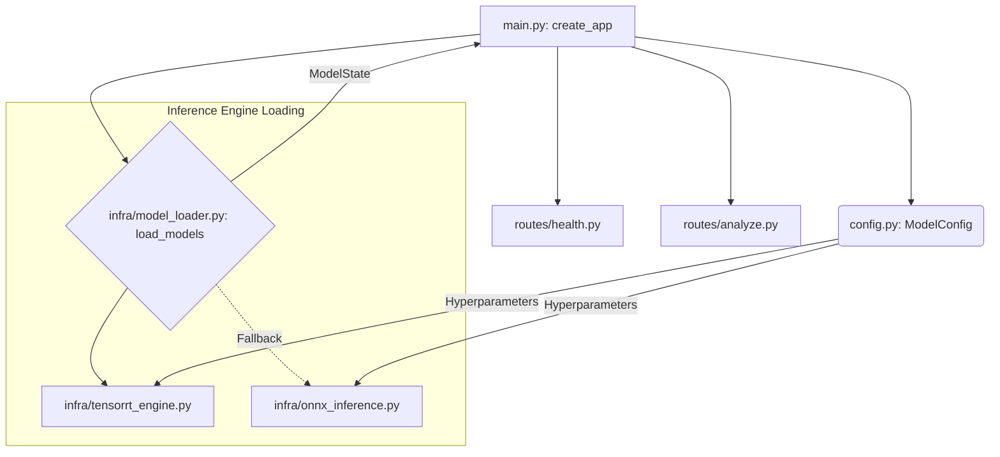

# 🗺️ AI Server 호출 관계 및 데이터 흐름 가이드

이 문서는 `ai-server`의 파일 간 호출 관계와 데이터의 흐름을 다이어그램으로 시각화하여, 소스 코드 분석을 돕기 위해 작성되었습니다.

---

## 1. 서버 부팅 시점: 객체 조립 (Static View)
서버가 시작되면 `main.py`가 컨트롤러가 되어 필요한 부품들을 모으고 서버를 구성합니다.



*   **핵심**: `main.py`는 `config`를 읽어 엔진을 만들고, 이를 `app.state`에 저장하여 모든 라우터가 공유하게 만듭니다.

---

## 2. 요청 처리 시점에: 데이터 흐름 (Dynamic Flow)
실제 `/analyze` 요청이 들어왔을 때 데이터가 어떻게 변하며 흐르는지 보여주는 **호출 지도**입니다.

```mermaid
sequenceDiagram
    participant C as Client (Node.js)
    participant R as routes/analyze.py
    participant P as core/preprocessing.py
    participant E as infra/InferenceEngine
    participant M as core/model.py (Actual Logic)
    participant S as core/iq_scorer.py

    C->>R: POST /analyze (Image Bytes)
    
    Note over R: 1. Validation (Magic Bytes)
    
    R->>P: 2. Preprocess (PIL -> Tensor)
    Note right of P: Resize(260), Normalize, etc.
    P-->>R: Normalized Numpy Array

    R->>E: 3. engine.run(img_np)
    
    subgraph "Inside AI Model (Logical Flow)"
    E->>M: Backbone (EffNet-B2)
    M-->>E: 1408 Features
    E->>M: 4 Heads (Linear Layers)
    M-->>E: 60 Raw Logits
    end

    E-->>R: (head_a, head_b, head_c, head_d)
    
    R->>R: 4. _logits_to_item_results()
    Note right of R: Sigmoid(>= 0.5) 연산

    R->>S: 5. score_to_result(raw_score)
    Note right of S: 전국 규준표 매핑
    S-->>R: IQ, Percentile

    R-->>C: 최종 JSON 리포트 응답
```

---

## 3. 클래스 및 파일별 역할 요약

| 파일/클래스 | 레이어 | 역할 (제1원칙 관점) |
| :--- | :--- | :--- |
| **`main.py`** | **Orchestrator** | **조립 기사**. 부품(엔진, 라우터)들을 모아 하나의 서버로 완성함. |
| **`config.py`** | **Registry** | **기준점**. 모든 컴포넌트가 참조하는 '진실된 치수(260, 1408 등)'를 가짐. |
| **`analyze.py`** | **Controller** | **지상 통제소**. 전처리하고, 모델에 넣고, 채점하는 일련의 파이프라인을 총괄함. |
| **`preprocessing.py`** | **Translator** | **통역사**. 인간의 그림(이미지)을 AI의 언어(텐서)로 변환함. |
| **`model.py`** | **Brain (Logical)** | **두뇌 설계도**. 어떻게 생각할지(1408개 특징 추출 및 4개 헤드 판단) 정의함. |
| **`onnx_inference.py`** | **Worker (Physical)** | **실전 일꾼**. 실제 연산 장치(CPU/GPU)를 돌려 수학적 계산을 수행함. |
| **`iq_scorer.py`** | **Judge** | **심판**. AI가 뱉은 숫자를 인간이 이해하는 '지능 지수'로 최종 판결함. |

---

## 💡 소스 코드 분석 팁
1.  **독립성 확인**: `config.py`는 다른 파일을 부르지 않으므로 가장 먼저 읽기 좋습니다.
2.  **의존성 파악**: 파일 상단의 `import` 문을 통해 누가 누구를 '부하 직원'으로 쓰는지 확인하세요.
3.  **테스트 매칭**: 각 파일 분석 시 `tests/` 폴더의 대응되는 테스트 코드를 함께 보면 입문이 훨씬 빠릅니다.
