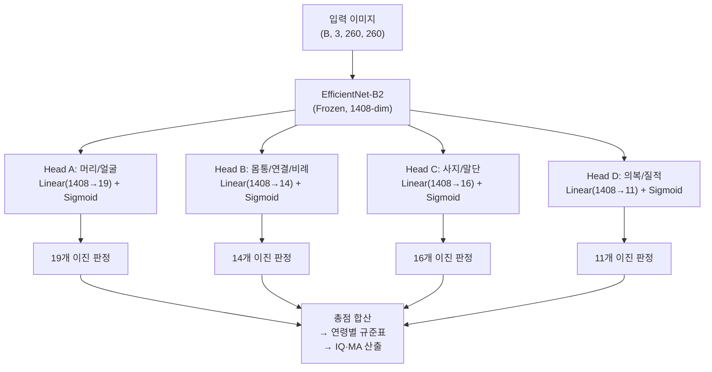

# HFD 도메인 분석 기반 AI 모듈 설계 명세서 (v2 — PDF 교차검증 완료)

> **인물화에 의한 간편지능검사** PDF 원본 60개 항목을 기반으로 Multi-head 설계를 확정합니다.

## User Review Required

> [!WARNING]
> **plan.md에 4개 TDD 항목 수정이 필요합니다.** 승인 시 수정을 진행합니다.

> [!IMPORTANT]
> **남녀 척도가 다릅니다.** 남자상/여자상 별도 모델이 필요하며, MVP에서는 **남자척도 모델을 먼저** 구현합니다.

---

## 핵심 설계 결정 요약

| 항목 | 결정 | 근거 |
|------|------|------|
| **분류 방식** | **Multi-label Binary (Sigmoid)** | HFD = 60개 독립 이진 판정(0/1) |
| **Backbone** | EfficientNet-B2 (pretrained, frozen) | ADR-010 |
| **입력 크기** | 260×260 | EfficientNet-B2 원논문 설계 |
| **Head 구성** | 4개 **(19/14/16/11)** | PDF 원본 문항 기준 |
| **Loss** | BCEWithLogitsLoss | Sigmoid+BCE 수치 안정 |
| **forward()** | Tuple 반환 | ONNX 호환 |
| **남녀 전략** | 별도 모델 (male.onnx / female.onnx) | 문항 차이 존재 |

---

## 아키텍처 다이어그램



---

## 4-Head 상세 매핑 (남자척도 60문항)

### Head A — 머리/얼굴 세부묘사 (19개)

| 출력 idx | 원본 문항# | 항목 |
|:--------:|:----------:|------|
| 0 | 1 | 머리 |
| 1 | 4 | 눈 |
| 2 | 5 | 눈의 세부: 눈썹 |
| 3 | 6 | 눈의 세부: 눈동자 |
| 4 | 7 | 눈의 세부: 비율 |
| 5 | 8 | 눈의 세부: 응시 |
| 6 | 9 | 코 |
| 7 | 10 | 코: 평면 |
| 8 | 11 | 입 |
| 9 | 12 | 입술: 평면 |
| 10 | 13 | 턱과 이마 |
| 11 | 14 | 턱의 돌출 |
| 12 | 15 | 턱의 선 |
| 13 | 16 | 콧날 |
| 14 | 17 | 머리카락 I |
| 15 | 18 | 머리카락 II |
| 16 | 19 | 머리카락 III |
| 17 | 20 | 귀 |
| 18 | 21 | 귀: 비율과 위치 |

### Head B — 몸통/연결/비례 (14개)

| 출력 idx | 원본 문항# | 항목 |
|:--------:|:----------:|------|
| 0 | 2 | 목 |
| 1 | 3 | 목: 평면 |
| 2 | 29 | 어깨 I |
| 3 | 30 | 어깨 II |
| 4 | 40 | 팔, 다리 달린 것 |
| 5 | 41 | 팔, 다리 달린 것 II (정확한 위치) |
| 6 | 42 | 동체 |
| 7 | 43 | 동체의 비율: 평면적 |
| 8 | 44 | 비율: 머리와 동체 |
| 9 | 45 | 비율: 얼굴 |
| 10 | 46 | 비율: 팔과 동체 |
| 11 | 47 | 비율: 팔 (가늘어지는 경향) |
| 12 | 48 | 비율: 다리와 동체 |
| 13 | 49 | 비율: 팔·다리 > 손·발 |

### Head C — 사지/말단 (16개)

| 출력 idx | 원본 문항# | 항목 |
|:--------:|:----------:|------|
| 0 | 22 | 손가락 |
| 1 | 23 | 정확한 수의 손가락 (5개) |
| 2 | 24 | 손가락의 정확한 세부 (길이>폭) |
| 3 | 25 | 엄지손가락의 분화 |
| 4 | 26 | 손 |
| 5 | 27 | 손목 또는 발목 |
| 6 | 28 | 팔 |
| 7 | 31 | 옆으로 내리거나 운동하고 있는 팔 |
| 8 | 32 | 다리 |
| 9 | 33 | 엉덩이 I (가랭이) |
| 10 | 34 | 엉덩이 II |
| 11 | 35 | 무릎관절 |
| 12 | 36 | 발 I |
| 13 | 37 | 발 II: 비율 |
| 14 | 38 | 발 III: 뒷꿈치 |
| 15 | 39 | 발 IV: 원근법 |

### Head D — 의복/질적 수준 (11개)

| 출력 idx | 원본 문항# | 항목 |
|:--------:|:----------:|------|
| 0 | 50 | 옷 I |
| 1 | 51 | 옷 II (불투명) |
| 2 | 52 | 옷 III |
| 3 | 53 | 옷 IV (4종류 이상) |
| 4 | 54 | 측면화 |
| 5 | 55 | 운동 조정: 선과 연결 |
| 6 | 56 | 세련된 선과 형태: 머리윤곽 |
| 7 | 57 | 세련된 선과 형태: 동체 |
| 8 | 58 | 세련된 선과 형태: 얼굴의 모양 |
| 9 | 59 | Sketch 및 실체감 표현의 기술 |
| 10 | 60 | 팔과 다리의 운동 |

---

## 남녀 별도 모델 전략

### 여자척도 주요 차이점
| 남자척도 | 여자척도 | 비고 |
|----------|----------|------|
| 8번: 눈 응시 | 8번: 뺨(화장) | Head A 항목 차이 |
| 12번: 입술 평면 | 12번: 콧구멍 | Head A 항목 차이 |
| 34번: 엉덩이 II | 34번: 신발 여성적 | Head C 항목 차이 |
| — | 45번: 치마 주름/옷감 | Head D 전용 |
| — | 47번: 여성적 옷 | Head D 전용 |

### 구현 로드맵
1. **Phase 4 Step 1**: 남자척도 모델 구현 (MVP) → `mind_palette_male.onnx`
2. **Phase 4 후반**: 여자척도 모델 구현 → `mind_palette_female.onnx`
3. **FastAPI 분기**: 요청 시 `gender` 파라미터로 모델 선택

---

## Proposed Changes

### [MODIFY] [plan.md](file:///c:/Users/user/Documents/GitHub/mind-palette-project/plan.md)

**수정 1** (Line 69) — 출력 Shape 구체화:
```diff
- [TDD][L1] 출력 텐서 Shape 테스트: 더미 입력 `(1,3,512,512)` → 각 head output `(1, num_classes)`, dtype=float32 (Red)
+ [TDD][L1] 출력 텐서 Shape 테스트: 더미 입력 `(1,3,260,260)` → Head A `(1,19)`, Head B `(1,14)`, Head C `(1,16)`, Head D `(1,11)`, dtype=float32 (Red)
```

**수정 2** (Line 76) — 입력 크기 260:
```diff
- [TDD][L2] Resize→Normalize→ToTensor 변환 테스트: 출력 shape==(1,3,224,224), 값 범위 검증 (Red)
+ [TDD][L2] Resize→Normalize→ToTensor 변환 테스트: 출력 shape==(1,3,260,260), 값 범위 [0,1] 검증 (Red)
```

**수정 3** (Line 80) — Softmax→Sigmoid:
```diff
- [TDD][L2] 고정 seed 입력 → 각 head softmax 출력 합 == 1.0 검증 (Red)
+ [TDD][L2] 고정 seed 입력 → 각 head sigmoid 출력 값이 모두 [0, 1] 범위 내 검증 (Red)
```

**수정 4** (Line 104) — ONNX 입력 크기 정합:
```diff
- [TDD][L1] 변환된 .onnx 파일의 입력 노드 shape==(1,3,224,224), 출력 노드 개수==4 검증 (Red)
+ [TDD][L1] 변환된 .onnx 파일의 입력 노드 shape==(1,3,260,260), 출력 노드 개수==4 검증 (Red)
```

### [NEW] ADR-018 추가 — [ARCHITECTURE_DECISIONS.md](file:///c:/Users/user/Documents/GitHub/mind-palette-project/docs/ARCHITECTURE_DECISIONS.md)

HFD 도메인 분석 기반 Multi-label Binary Classification 아키텍처 채택 및 남녀 별도 모델 전략 기록.

---

## Verification Plan

### 자동 테스트 (plan.md 수정 후 Phase 4 구현 시)
- `pytest`: 모델 출력 shape (1,19)/(1,14)/(1,16)/(1,11) 검증
- `pytest`: Sigmoid 출력 범위 [0,1] 검증
- `pytest`: 총 출력 뉴런 합 = 60 검증

### 수동 검증
- plan.md 4개 수정 항목이 다른 항목과 모순이 없는지 확인
- 남자척도 60개 항목 번호와 매핑 테이블 일치 확인 완료 (NotebookLM 교차검증)
