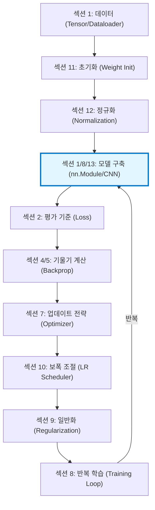

# 딥러닝 + PyTorch 실무 강의: 전체 프로세스 핵심 요약

> **제1원칙 사고 (First Principles Thinking)**: 딥러닝 학습은 마법이 아니라, **"데이터를 기반으로 오차를 최소화하는 파라미터를 찾아가는 수치 최적화 과정"**입니다. 이 과정을 9가지 핵심 단계로 분해하여 각 섹션의 역할을 연결합니다.

---

## 🎯 딥러닝 학습의 본질적 목표
> **"모델의 출력($\hat{y}$)과 실제 정답($y$) 사이의 거리($Loss$)를 최소화하는 가중치($W$)를 찾는 것"**

---

## 🔬 1원칙 기반 프로세스 분해 및 섹션 매핑

### 1단계: 데이터의 준비 (Input Pipeline)
*   **근본 진실**: 컴퓨터는 숫자(Tensor)만 이해하며, 학습의 품질은 데이터의 양과 질에 결정된다.
*   **담당 섹션**: **섹션 1**
*   **핵심 요소**:
    *   `Tensor`: 데이터를 담는 다차원 행렬 그릇
    *   `Dataset & DataLoader`: 데이터를 효율적으로 공급하는 파이프라인
    *   `Data Augmentation`: 적은 데이터로도 다양한 상황을 학습하게 하는 증강 기법

### 2단계: 최적의 출발지 설정 (Initialization)
*   **근본 진실**: 어디서 시작(초기값)하느냐가 산 정상(최적점)에 도달하는 시간과 성공 여부를 결정한다.
*   **담당 섹션**: **섹션 11**
*   **핵심 요소**:
    *   `Xavier/Kaiming`: 활성화 함수 특성에 맞춰 신호 강도(분산)를 유지하는 초기화
    *   `Transfer Learning`: 이미 성공한 지도를 가져와서 출발지로 사용

### 3단계: 신호의 안정화 (Normalization)
*   **근본 진실**: 레이어를 거칠 때마다 데이터 분포가 요동치면 학습이 불안정해진다. 이를 방파제처럼 가다듬어줘야 한다.
*   **담당 섹션**: **섹션 12**
*   **핵심 요소**:
    *   `Batch/Layer/Instance/Group Norm`: 특정 차원(배치, 채널, 데이터 등)을 기준으로 평균 0, 분산 1로 조정

#### [정규화의 4가지 유형]
| 방법 | 정규화 단위 (영역) | 주로 사용되는 곳 | PyTorch 구현 |
|------|-------------------|------------------|--------------|
| **Batch Norm** | (Batch, Height, Width) | CNN (일반적인 경우) | `nn.BatchNorm2d` |
| **Layer Norm** | (Channel, Height, Width) | Transformer, NLP | `nn.LayerNorm` |
| **Instance Norm** | (Height, Width) | Style Transfer, GAN | `nn.InstanceNorm2d` |
| **Group Norm** | 채널 그룹화 후 정규화 | 소규모 배치(Small Batch) | `nn.GroupNorm` |

#### [차원별 시각적 이해 (N: Batch, C: Channel)]
- **BatchNorm**: (N, H, W) 방향 평균 (C축 유지)
- **LayerNorm**: (C, H, W) 방향 평균 (N축 독립)
- **InstanceNorm**: (H, W) 방향 평균 (N, C축 모두 독립)
- **GroupNorm**: (C/G, H, W) 방향 평균 (N축 독립)

### 4단계: 예측 모델 구축 (Architecture)
*   **근본 진실**: 입력데이터를 추상적인 특징으로 변환해줄 적절한 층(Layer)의 깊이가 필요하다.
*   **담당 섹션**: **섹션 1 & 섹션 8 & 섹션 13**
*   **핵심 요소**:
    *   `nn.Module / Sequential`: 신경망의 구조를 설계하는 뼈대
    *   `FC Layers (Linear)`: 데이터 간의 관계를 수식화하는 선형 결합
    *   `CNN Layers (Conv2d)`: 이미지의 공간적 패턴을 효율적으로 학습

#### 💡 섹션 1/8/13이 함께 묶인 이유:
- **섹션 1**: 기본 구성 요소 (Tensor, nn.Module)
- **섹션 8**: 모델 조립 방법 (Sequential, forward)
- **섹션 13**: 이미지 특화 레이어 (Conv2d, Pooling)
	→ 모두 "**신경망 아키텍처를 어떻게 설계하는가?**"에 대한 내용

#### [CNN의 핵심 파라미터 (섹션 13)]
| 파라미터 | 역할 | 출력 크기 영향 | 실무 권장값 |
|---------|------|---------------|------------|
| **kernel_size** | 필터 크기 (시야) | 클수록 **감소** | 3 (표준) |
| **padding** | 입력 주변 0 추가 | 클수록 **증가** | 1 (크기 유지) |
| **stride** | 필터 이동 간격 | 클수록 **감소** | 1 (Pooling으로 축소) |
| **dilation** | 필터 요소 간 간격 | 클수록 **감소** | 1 (기본) |

#### [완전한 CNN 모델 구조 (nn.Module)]
```python
class CNNModel(nn.Module):
    def __init__(self):
        super().__init__()
        # Block 1: (3,32,32) → (16,16,16)
        # Block 2: (16,16,16) → (32,8,8)
        # Block 3: (32,8,8) → (64,4,4)
        # Flatten → Linear: (1024,) → (10,)
        
    def forward(self, x):
        # 순방향 전파 정의
        return output
```

**핵심 레이어**:
- **Pooling (MaxPool/AvgPool)**: 공간 크기 축소 (계산량 감소, 추상화)
- **Flatten**: 3D(C,H,W) → 1D(C×H×W) 변환
- **초기화**: ReLU → Kaiming, Sigmoid/Tanh → Xavier

**Shape 변환 패턴**:
```
(3,32,32) → Conv+Pool → (16,16,16) → Conv+Pool → (32,8,8) 
→ Conv+Pool → (64,4,4) → Flatten → (1024) → Linear → (10)
# 공간↓ 채널↑ (점진적 추상화)
```


### 5단계: 오차 측정의 기준 설정 ([[Loss Function]])

*   **근본 진실**: "틀렸다"는 것을 수학적으로 정의해야만 수정할 수 있다.
*   **담당 섹션**: **섹션 2**
*   **핵심 요소**:
    *   `MSE / CrossEntropy`: 결과의 '틀린 정도'를 하나의 숫자로 환산하는 기준점

### 5단계: 수정 방향의 결정 (Gradient Descent Theory)
*   **근본 진실**: 어느 방향으로 가야 오차가 줄어드는지 알기 위해 기울기(미분)를 사용한다.
*   **담당 섹션**: **섹션 4 & 섹션 5**
*   **핵심 요소**:
    *   `Backpropagation`: 출력에서 입력 방향으로 오차의 책임을 묻는 과정
    *   `Gradient`: 각 가중치가 오차에 기여한 정도

### 6단계: 실제 가중치 업데이트 (Optimization)
*   **근본 진실**: 단순히 기울기 방향으로 가는 것을 넘어, 관성이나 속도를 조절하여 더 효율적으로 이동한다.
*   **담당 섹션**: **섹션 7**
*   **핵심 요소**:
    *   `SGD / Momentum / Adam`: 가중치를 실제로 수정하는 전략 알고리즘

### 7단계: 보폭의 정밀 조절 (Learning Rate Scheduler)
*   **근본 진실**: 처음엔 크게 걷고, 목적지 근처에서는 조심스럽게 걸어야 정확히 안착한다.
*   **담당 섹션**: **섹션 10**
*   **핵심 요소**:
    *   `StepLR / CosineAnnealing`: 학습 진행에 따라 보폭(LR)을 유동적으로 조절

### 8단계: 과적합 방지 및 제약 (Regularization)
*   **근본 진실**: 학습 데이터에만 너무 집착하면 새로운 데이터에서 실패한다. 모델의 자유도를 억제해야 한다.
*   **담당 섹션**: **섹션 9**
*   **핵심 요소**:
    *   `Dropout / Weight Decay / L1, L2`: 가중치가 너무 커지거나 특정 뉴런에 의존하는 것을 방지

### 9단계: 전체 프로세스 실행 및 루프 (Training Loop)
*   **근본 진실**: 위의 모든 단계를 조화롭게 연결하여 반복 수행해야 학습이 완성된다.
*   **담당 섹션**: **섹션 8**
*   **핵심 요소**:
    *   `train_loop / val_loop`: 예측-측정-수정의 무한 반복 과정

---

## 🔗 종합 연결도: 모든 것이 어우러지는 과정



> 💡 **섹션 1/8/13이 함께 묶인 이유**:  
> - **섹션 1**: 기본 구성 요소 (Tensor, nn.Module)  
> - **섹션 8**: 모델 조립 방법 (Sequential, forward)  
> - **섹션 13**: 이미지 특화 레이어 (Conv2d, Pooling)  
> → 모두 "신경망 아키텍처를 어떻게 설계하는가?"에 대한 내용

---

## 🎯 결론: 1원칙 사고 요약

딥러닝을 잘한다는 것은 결국 아래의 **균형(Trade-off)**을 맞추는 것입니다:

1.  **신호의 유지**: (섹션 11. 초기화)를 통해 신호가 사라지지 않게 출발
2.  **흐름의 안정**: (섹션 12. 정규화)를 통해 내부의 데이터 요동을 방지
3.  **보폭의 최적화**: (섹션 7. 옵티마이저 & 섹션 10. 스케줄러)를 통해 효율적으로 수렴
4.  **고집의 억제**: (섹션 9. 정규화/Regularization)를 통해 자기 데이터에만 빠지지 않게 관리

> 이 지도를 머릿속에 넣고 각 섹션의 코드들을 바라보면, 단순한 API 호출이 아니라 **"수렴을 향한 정교한 제어"**임을 이해하실 수 있습니다. 이 지식들은 [[아동_인물화_지능측정_AI_시스템_프로젝트_계획서]] 프로젝트의 추론 엔진 구현에 직접적으로 사용됩니다.

---

## 🏛️ 대표 CNN 아키텍처 비교 (섹션 13 확장)

### VGGNet - "작은 필터(3×3)의 깊이 전략"

```
VGGNet = 3×3 Conv만을 반복 적용하여 깊이를 극대화한 아키텍처
       → 2014년 ILSVRC 2위
       → 3×3 Conv 2개 = 5×5와 동일 receptive field, 파라미터 45% 절감
```

| 모델 | 레이어 수 | BN 유무 | 총 파라미터 | 비고 |
|------|-----------|---------|------------|------|
| `vgg11` | 11 | ✗ | ~133M | 가장 얕은 버전 |
| `vgg11_bn` | 11 | ✓ | ~133M | BN 추가로 학습 안정화 |
| `vgg16` | 16 | ✗ | ~138M | 가장 널리 사용 |
| `vgg19` | 19 | ✗ | ~144M | 가장 깊은 버전 |

**⚠️ 핵심 문제**: FC Layer가 전체 파라미터의 93% 차지 (~124M / ~133M)

### ResNet - "Skip Connection으로 깊이의 한계 돌파"

```
ResNet = Skip Connection(잔차 연결)으로 입력을 출력에 직접 더하는 아키텍처
       → y = F(x) + x: 네트워크가 "잔차(residual)"만 학습
       → 기울기 소실 문제를 구조적으로 해결
       → 100+ 레이어도 안정적으로 학습 가능
```

| 모델 | 레이어 수 | Block 타입 | 총 파라미터 | 특징 |
|------|-----------|-----------|------------|------|
| `resnet18` | 18 | BasicBlock | ~11.7M | 가벼운 실험용 |
| `resnet50` | 50 | Bottleneck | ~25.6M | 실무 표준 |
| `resnet152` | 152 | Bottleneck | ~60.2M | 최대 깊이 |

### VGGNet vs ResNet 핵심 비교

| 핵심 개념 | VGGNet | ResNet |
|----------|--------|--------|
| 설계 철학 | 단순하게 깊이만 늘림 | 잔차 학습으로 깊이 한계 돌파 |
| 필터 전략 | 3×3 일관 | 7×7(초기) + 3×3 + 1×1(Bottleneck) |
| 파라미터 | ~133M (VGG16) | ~11.7M (ResNet18) |
| 핵심 혁신 | 작은 필터의 효과 증명 | Skip Connection |
| FC Layer | 3개 (파라미터 93%) | 1개 (GAP 사용) |
| 실무 선호도 | 특징 추출기로 활용 | 범용 backbone 모델 |

### CIFAR-10 실전 비교 실험 (Custom CNN vs VGG vs ResNet)

| 관찰 포인트 | 예상 결과 | 이유 |
|------------|----------|------|
| BN 유무 차이 | VGG11_BN > VGG11 | BN이 학습 안정화, 수렴 가속 |
| 아키텍처 효율성 | ResNet18 ≥ VGG11_BN | Skip Connection + 적은 파라미터 |
| 과적합 위험 | VGG > ResNet | VGG의 FC Layer 파라미터 과다 |
| 학습 속도 | Custom > ResNet > VGG | 파라미터 수에 비례 |

```
CNN 아키텍처 발전 흐름:
LeNet (1998) → AlexNet (2012) → VGGNet (2014) → ResNet (2015)
     │                │                │               │
   기본 구조        GPU 활용       3×3 필터 깊이     Skip Connection
   5×5 필터        11×11 필터       극대화 전략       기울기 소실 해결
```

> 💡 **결론**: CNN 아키텍처의 발전은 **"더 깊게, 더 효율적으로"**라는 방향으로 진화했습니다. 실무에서는 **ResNet 계열이 기본 backbone**으로, **VGGNet은 특징 추출기(Feature Extractor)**로 주로 사용됩니다.
