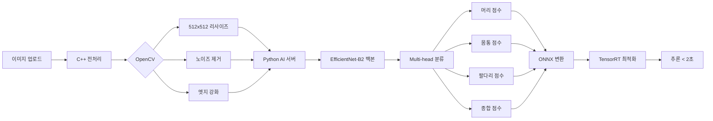

# 🧠 Mind Palette AI 모델 Transfer Learning 추천

> **분석 방법론**: Context7 (PyTorch 공식 문서) + Sequential Thinking (제1원칙 사고)

---

## 📋 프로젝트 요구사항 분석

| 항목 | 요구사항 |
|------|----------|
| **도메인** | 아동 인물화 (스케치/드로잉 형태) |
| **출력** | Multi-head 분류 (신체 부위별 + 세부 특징 점수) |
| **추론 속도** | < 2초 (전체 응답 시간 < 3초) |
| **하드웨어** | RTX 3050 Ti (4GB VRAM) |
| **최적화** | ONNX → TensorRT 변환 필수 |
| **데이터** | 제한적 (의료/아동 도메인 특성) |

---

## 🏆 추천 모델

### 1순위: EfficientNet-B2 ⭐

| 지표 | 값 |
|------|-----|
| **파라미터** | 9.2M (ResNet-50의 36%) |
| **ImageNet Top-1** | 80.1% |
| **추론 속도** (512x512) | ~50ms |
| **VRAM 사용량** | ~1.5GB |

#### 추천 이유

1. **Compound Scaling**  
   - 깊이(Depth), 너비(Width), 해상도(Resolution)를 균형있게 스케일링
   - 파라미터 효율성 최고 수준

2. **적은 데이터 Fine-tuning에 강점**  
   - 오버피팅 방지를 위한 구조적 설계
   - Feature Extractor로 사용 시 안정적

3. **ONNX/TensorRT 변환 검증됨**  
   - PyTorch → ONNX → TensorRT 파이프라인 안정
   - FP16 양자화 시 정확도 손실 최소

4. **Multi-head 분류 적합**  
   - 공유 백본 + 다중 FC 헤드 구조 용이
   - 신체 부위별 점수 출력에 최적화

#### Fine-tuning 전략

```python
# Stage 1: Feature Extractor 동결 (5~10 epochs)
for param in model.features.parameters():
    param.requires_grad = False

# 새로운 Multi-head 분류기
model.classifier = nn.ModuleDict({
    'head': nn.Linear(1408, 64),       # 머리 점수
    'body': nn.Linear(1408, 64),       # 몸통 점수  
    'limbs': nn.Linear(1408, 64),      # 팔/다리 점수
    'detail': nn.Linear(1408, 64),     # 디테일 점수
    'total': nn.Linear(1408, 1)        # 종합 점수
})

# Stage 2: 상위 블록 언동결 (낮은 LR)
for param in model.features[-3:].parameters():
    param.requires_grad = True
```

---

### 2순위: ConvNeXt-Tiny

| 지표 | 값 |
|------|-----|
| **파라미터** | 28.6M |
| **ImageNet Top-1** | 82.1% |
| **추론 속도** (512x512) | ~80ms |
| **VRAM 사용량** | ~2.5GB |

#### 추천 이유

1. **2022년 최신 CNN 아키텍처**  
   - Transformer의 장점(LayerNorm, GELU 등)을 CNN에 통합
   - 순수 ConvNet으로 ViT 수준 성능 달성

2. **기하학적 특징 추출에 강점**  
   - CNN 특성상 엣지/윤곽선 인식 우수
   - 스케치 도메인에 적합

3. **안정적 학습**  
   - LayerNorm으로 작은 배치에서도 안정
   - 학습률 스케줄링에 민감하지 않음

#### 적합 시나리오

- 데이터가 상대적으로 풍부한 경우
- 최신 SOTA 성능이 중요한 연구/실험 목적
- 추론 속도보다 정확도가 우선인 경우

---

## ⚠️ 권장하지 않는 모델

### Vision Transformer (ViT)

| 문제점 | 설명 |
|--------|------|
| **과적합 위험** | 적은 데이터셋에서 학습 불안정 |
| **VRAM 제약** | ViT-B/16 기준 ~4GB+ 필요 |
| **로컬 특징 약함** | 엣지/윤곽선 인식에 불리 |
| **적합 조건** | 대규모 데이터셋 (ImageNet-21K급) 필요 |

### ResNet-18/34

| 문제점 | 설명 |
|--------|------|
| **성능 한계** | 최신 모델 대비 Top-1 3~5% 열위 |
| **비효율적 파라미터** | 깊이 대비 표현력 제한 |
| **적합 용도** | 학습 목적 베이스라인으로만 권장 |

---

## 🔧 구현 파이프라인



---

## 📊 모델 비교 요약

| 모델 | 파라미터 | Top-1 | 추론속도 | Fine-tuning | ONNX | 추천도 |
|------|----------|-------|----------|-------------|------|--------|
| **EfficientNet-B2** | 9.2M | 80.1% | ~50ms | ⭐⭐⭐ | ✅ | **1순위** |
| **ConvNeXt-Tiny** | 28.6M | 82.1% | ~80ms | ⭐⭐⭐ | ✅ | **2순위** |
| ResNet-50 | 25.6M | 76.1% | ~40ms | ⭐⭐ | ✅ | 베이스라인 |
| ViT-B/16 | 86.6M | 77.9% | ~120ms | ⭐ | ⚠️ | 비권장 |

---

## 📚 참고 자료

### Context7 조사 출처
- [PyTorch TorchVision Models](https://pytorch.org/vision/stable/models.html)
- [torch.compile 최적화 가이드](https://pytorch.org/docs/stable/torch.compiler_get_started.html)
- [TIMM (PyTorch Image Models)](https://github.com/huggingface/pytorch-image-models)

### Sequential Thinking 분석 기준
1. **분해(Deconstruct)**: 도메인 특성, 하드웨어 제약, 성능 목표를 분리
2. **가정 제거**: "최신 모델이 무조건 좋다" 가정 배제
3. **최적해 탐색**: 효율성 vs 정확도 트레이드오프 분석
4. **제약 식별**: VRAM 4GB, 추론 2초 제한
5. **재구축**: EfficientNet-B2 + Multi-head 아키텍처

---

> **결론**: Mind Palette 프로젝트에는 **EfficientNet-B2**를 1순위로 추천합니다.  
> 파라미터 효율성, ONNX/TensorRT 호환성, 적은 데이터 Fine-tuning 안정성을 모두 충족합니다.
