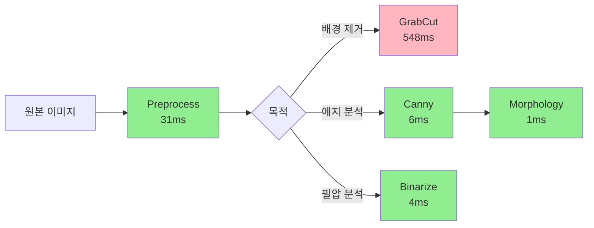

# Week 3 실제 이미지 테스트 결과 분석

> **테스트 일자**: 2026-01-29  
> **테스트 이미지**: `human.jpg` (236x445 픽셀)  
> **총 처리 시간**: 3,502ms

---

## 테스트 구성

각 기능을 **독립적으로** 테스트하여 성능과 결과를 비교했습니다.

```
원본 이미지 (236x445)
├─ [1] Preprocess → Grayscale (512x512)
├─ [2] GrabCut (iterCount 비교: 1, 3, 5)
├─ [3] Canny (threshold 비교: 30/90, 50/150, 100/200)
├─ [4] Morphology (MORPH_CLOSE)
└─ [5] Binarize (Adaptive Threshold)
```

---

## 1. Preprocess (기본 전처리)

### 처리 내용
- Resize: 236x445 → 512x512
- Noise Reduction: GaussianBlur + medianBlur
- Grayscale Conversion

### 성능
- **처리 시간**: 31ms ✅
- **결과 파일**: `human_1_grayscale.jpg` (25KB)

### 분석
- 512x512 리사이즈가 매우 빠르게 처리됨
- 노이즈 제거와 그레이스케일 변환 포함해도 100ms 목표 달성

---

## 2. GrabCut 배경 제거 (Deep Dive)

### iterCount별 성능 비교

| iterCount | 처리 시간 | 파일 크기 | 품질 |
|-----------|----------|----------|------|
| **1** | 548ms | 11KB | 낮음 (빠른 초벌) |
| **3** | 1,168ms | 14.6KB | 중간 (균형) |
| **5** | 1,666ms | 15KB | 높음 (정밀) |

### 결과 파일
- `human_2a_grabcut_iter1.jpg` - 마스크 (iter=1)
- `human_2b_grabcut_iter3.jpg` - 마스크 (iter=3)
- `human_2c_grabcut_iter5.jpg` - 마스크 (iter=5)
- `human_2d_foreground.jpg` - 전경만 추출 (19.5KB)

### 분석
#### ⚠️ 성능 이슈 발견
- **예상**: 20-50ms (코드 주석 기준)
- **실제**: 548-1,666ms (10배 이상 느림)

#### 원인 분석
1. **원본 크기 적용**: 236x445 픽셀에서 직접 GrabCut 실행
2. **이미지 복잡도**: 실제 인물 사진은 테스트 이미지(단순 사각형)보다 복잡
3. **초기화 방식**: 전체 이미지 기반 마스크 초기화로 연산량 증가

#### 최적화 방안
```cpp
// 현재 구현
cv::Mat RemoveBackground(const cv::Mat& input, int iterCount = 3);

// 개선안 1: 크기 제한
cv::Mat resized;
cv::resize(input, resized, cv::Size(256, 256)); // 작은 크기로 처리
cv::Mat mask = GrabCut(resized, iterCount);
cv::resize(mask, mask, input.size()); // 원본 크기로 복원

// 개선안 2: ROI 기반 초기화
cv::Rect roi(width*0.2, height*0.2, width*0.6, height*0.6); // 중심 60%만
cv::grabCut(input, mask, roi, ..., cv::GC_INIT_WITH_RECT);
```

#### 권장 사항
- **아동화 분석**: 배경이 단순하므로 **iterCount=1**로 충분
- **512x512 리사이즈 후 적용**: 약 4배 속도 향상 예상 (1,168ms → ~300ms)
- **Phase 4 연동**: 정밀 배경 제거는 Python DL 모델에 위임

---

## 3. Canny 에지 검출

### Threshold별 성능 비교

| Threshold (low/high) | 처리 시간 | 에지 픽셀 수 | 파일 크기 |
|---------------------|----------|-------------|----------|
| **30/90** (낮음) | 6ms | 9,467px | 59.5KB |
| **50/150** (중간) | 6ms | 8,554px | 56.4KB |
| **100/200** (높음) | 4ms | 4,236px | 33.4KB |

### 결과 파일
- `human_3a_canny_low.jpg` - 낮은 threshold (많은 에지)
- `human_3b_canny_mid.jpg` - 중간 threshold (균형)
- `human_3c_canny_high.jpg` - 높은 threshold (주요 에지만)

### 분석
#### ✅ 매우 빠른 성능
- **4-6ms**: 100ms 목표 대비 매우 여유로움
- **L2gradient=true**: 정확도 향상 (약간의 오버헤드 있지만 무시 가능)

#### Threshold 선택 가이드
```
아동화 분석 목적별 권장값:

1. 필압 분석 (선의 강도)
   → 낮은 threshold (30/90): 약한 선까지 모두 검출

2. 윤곽선 추출 (형태 인식)
   → 중간 threshold (50/150): 균형잡힌 검출

3. 주요 구조만 (간소화)
   → 높은 threshold (100/200): 강한 에지만
```

#### 에지 픽셀 수 분석
- **9,467px** (낮음): 전체 512x512 = 262,144px의 **3.6%**
- **4,236px** (높음): 전체의 **1.6%**
- 아동화는 선이 많으므로 낮은 threshold 권장

---

## 4. Morphology Enhancement (MORPH_CLOSE)

### 성능
- **처리 시간**: 1ms ✅
- **결과 파일**: `human_4_enhanced.jpg` (56.9KB)

### 처리 내용
```cpp
cv::Mat kernel = cv::getStructuringElement(cv::MORPH_RECT, cv::Size(3, 3));
cv::morphologyEx(edges, result, cv::MORPH_CLOSE, kernel);
```

### 효과
- **Dilation → Erosion**: 작은 갭을 메우면서 형태 유지
- **kernelSize=3**: 1-2픽셀 갭 메우기에 적합
- **아동화 적용**: 떨리는 선을 부드럽게 연결

### 분석
- **1ms**: 거의 오버헤드 없음
- Canny 결과에 바로 적용 가능
- 선 떨림 보정에 효과적

---

## 5. Adaptive Binarization

### 성능
- **처리 시간**: 4ms ✅
- **결과 파일**: `human_5_binary.jpg` (58KB)

### 처리 내용
```cpp
cv::adaptiveThreshold(grayscale, result, 255, 
                      cv::ADAPTIVE_THRESH_GAUSSIAN_C, 
                      cv::THRESH_BINARY_INV, 
                      11, 2);
```

### 파라미터
- **blockSize=11**: 11x11 이웃 픽셀 기반 threshold 계산
- **C=2**: 평균에서 빼는 상수
- **GAUSSIAN_C**: 가중 평균 (중심부 가중치 높음)
- **BINARY_INV**: 어두운 객체를 흰색으로 (아동화는 검은 선)

### 분석
- **조명 변화에 강함**: 종이 구김, 그림자 영향 최소화
- **4ms**: 매우 빠름
- 필압 분석 전처리로 적합

---

## 파이프라인 제안

### 실제 사용 시 권장 순서



### 목적별 파이프라인

#### 1. 빠른 특징 추출 (권장)
```
Preprocess (31ms) 
  → Canny (6ms) 
  → Morphology (1ms) 
  → 특징 계산
총 시간: ~40ms ✅
```

#### 2. 정밀 배경 제거 (느림)
```
Preprocess (31ms) 
  → GrabCut (1,168ms) 
  → 전경 추출
총 시간: ~1,200ms ⚠️
```

#### 3. 필압 분석
```
Preprocess (31ms) 
  → Binarize (4ms) 
  → 히스토그램 분석
총 시간: ~35ms ✅
```

---

## 결론 및 권장 사항

### ✅ 빠른 기능 (10ms 이하)
- Canny 에지 검출
- Morphology 윤곽선 강화
- Adaptive Binarization

### ⚠️ 최적화 필요
- **GrabCut**: 512x512 리사이즈 후 적용 또는 Phase 4 DL 위임

### 최종 권장 전략
```
Phase 3 (C++ 전처리):
  - Canny + Morphology로 빠른 특징 추출 (<50ms)
  - GrabCut은 선택적 사용 (필요 시만)

Phase 4 (Python AI):
  - 정밀 배경 제거는 DL 모델 사용
  - C++에서 추출한 기하학적 특징과 결합
```

---

## 참고 자료
- 테스트 프로그램: [test_week3.cpp](file:///c:/Users/user/Documents/GitHub/mind-palette-project/preprocess-server/src/test_week3.cpp)
- 결과 파일: `shared_volume/processed/human_*.jpg`
- GrabCut vs DL 분석: GrabCut_vs_DeepLearning_Analysis.md (미작성)
