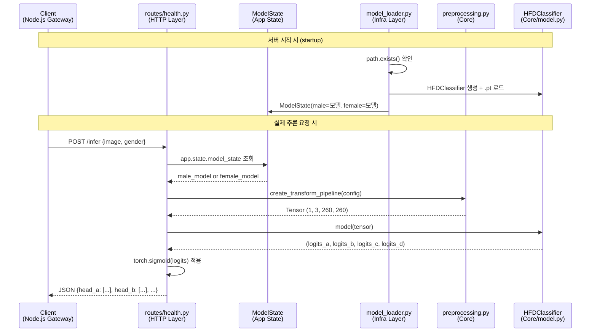
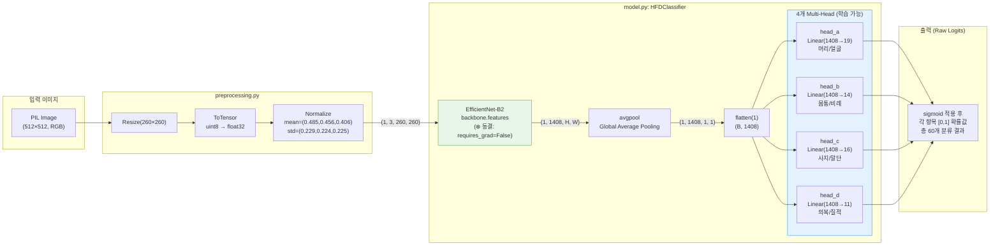
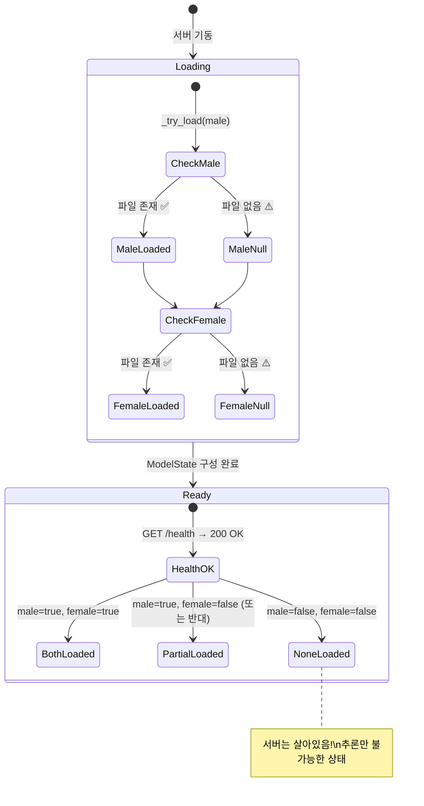
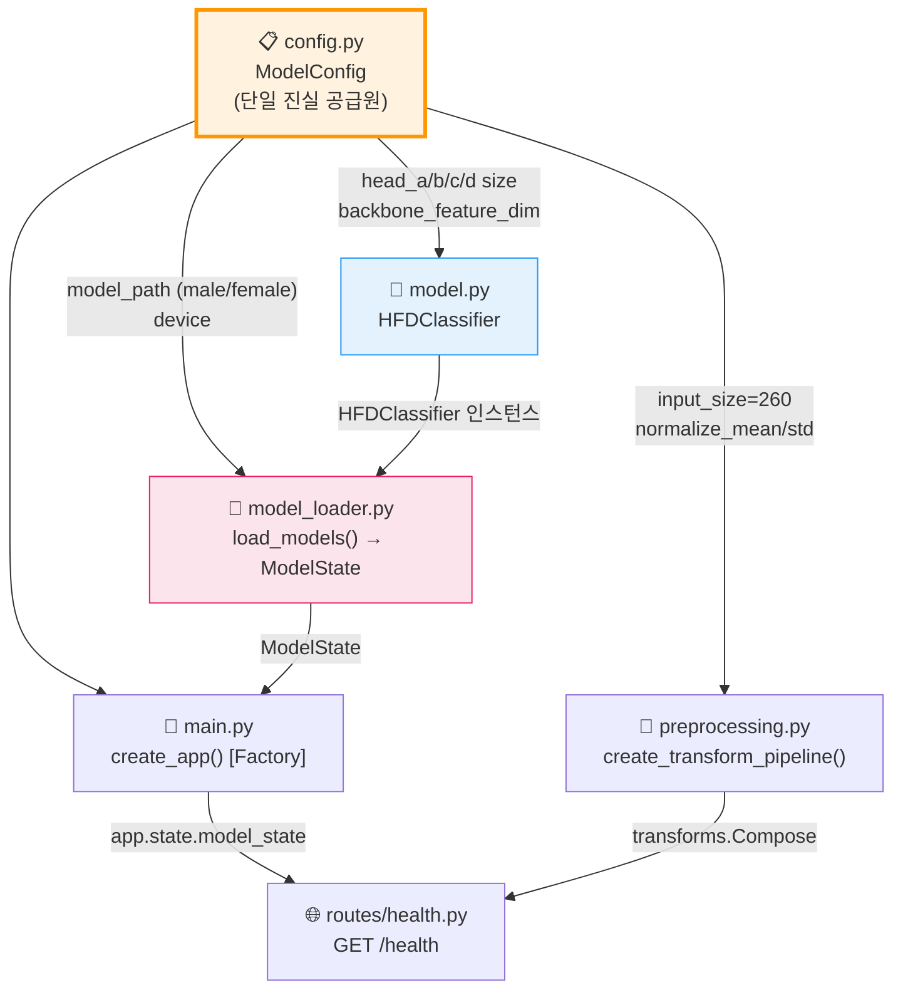

# 🏗️ ai-server 전체 구조 및 아키텍처 분석 리포트

본 문서는 `ai-server`의 내부 디렉터리 구조, 데이터 흐름, 신경망 아키텍처 및 시스템 레이어 간의 의존 관계를 직관적으로 설명합니다.

---

## 1. 디렉터리 레이아웃과 역할 분리

```
ai-server/
├── src/                        ← 프로덕션 코드
│   ├── main.py                 ← FastAPI 앱 팩토리 (조립자)
│   ├── config.py               ← 모든 하이퍼파라미터 중앙 관리
│   ├── core/                   ← AI 핵심 연산 (순수 Python/PyTorch)
│   │   ├── model.py            ← HFDClassifier 신경망 정의
│   │   └── preprocessing.py    ← 이미지 → 텐서 변환 파이프라인
│   ├── infra/                  ← 외부 의존성 처리 (파일I/O, 장애 방어)
│   │   └── model_loader.py     ← .pt 가중치 로드 + 상태 관리
│   └── routes/                 ← HTTP 엔드포인트
│       └── health.py           ← GET /health
└── tests/                      ← TDD 테스트
    ├── test_model_architecture.py  ← L1: 구조 검증
    ├── test_preprocessing.py       ← L1+L2: 전처리 검증
    ├── test_inference.py           ← L2: 추론 로직 검증
    ├── test_health.py              ← L1+L3: API 응답 + 장애 방어
    └── test_e2e_real_image.py      ← 실제 이미지 E2E 검증
```

---

## 2. 요청 처리 흐름 (Request Flow)



---

## 3. HFDClassifier 내부 텐서 변환 흐름 (Architecture)



---

## 4. 모델 로딩과 장애 방어 상태 흐름 (Infra Layer)



---

## 5. 레이어 간 의존 관계 (Dependency Graph)



---

## 6. 핵심 설계 원칙 요약

| 관심사 | 담당 파일 | 핵심 원칙 |
|:---|:---|:---|
| **하이퍼파라미터** | `config.py` | 하드코딩 제로 — 모든 수치가 여기서 관리 |
| **신경망 구조** | `core/model.py` | backbone 동결 / head만 학습 / Logits 반환 |
| **이미지 변환** | `core/preprocessing.py` | Config 기반 Normalize — 통계값 교체 가능 |
| **가중치 로딩** | `infra/model_loader.py` | 파일 없어도 서버 기동 — 상태로 추적 |
| **HTTP API** | `routes/health.py` | 모델 상태를 JSON으로 외부에 노출 |
| **앱 조립** | `main.py` | Factory 패턴 — 테스트 격리 가능 |

---
**작성자**: Antigravity AI Assistant  
**작성일**: 2026-03-14
