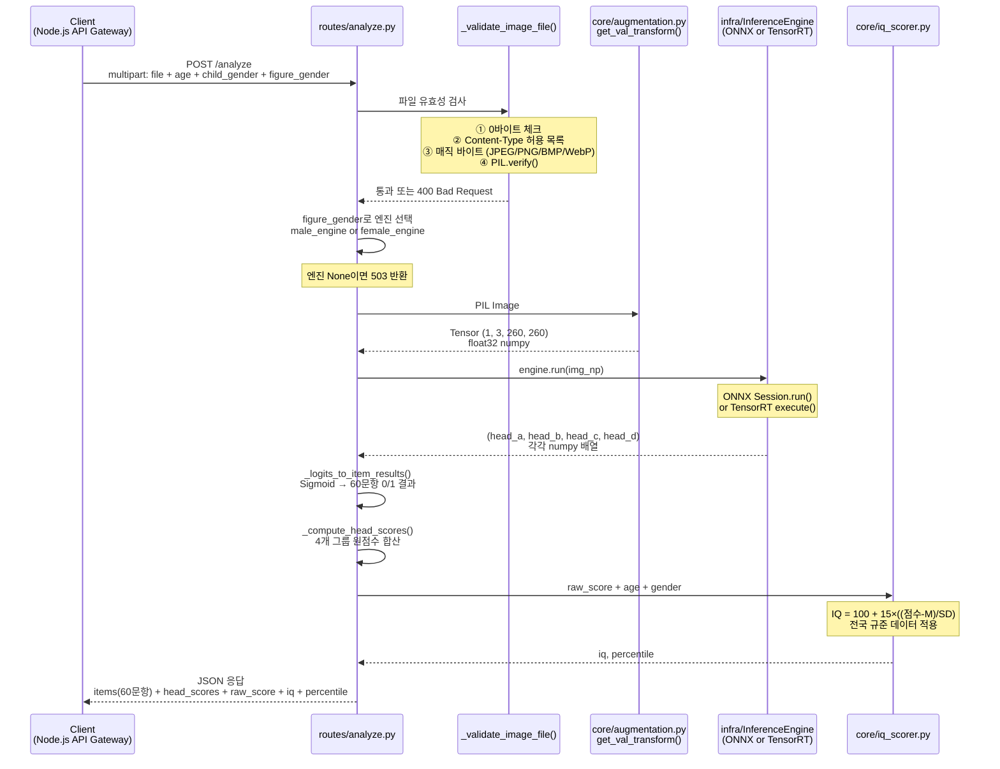
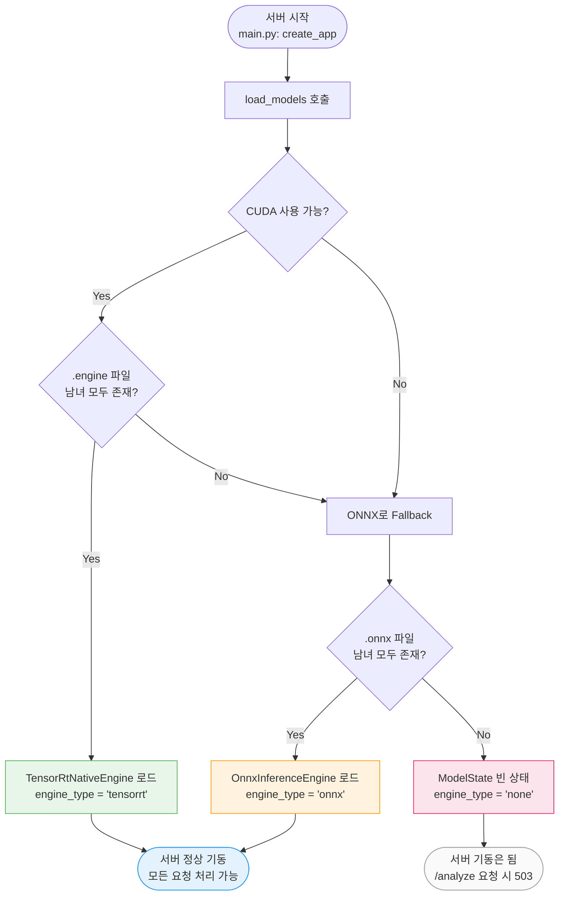
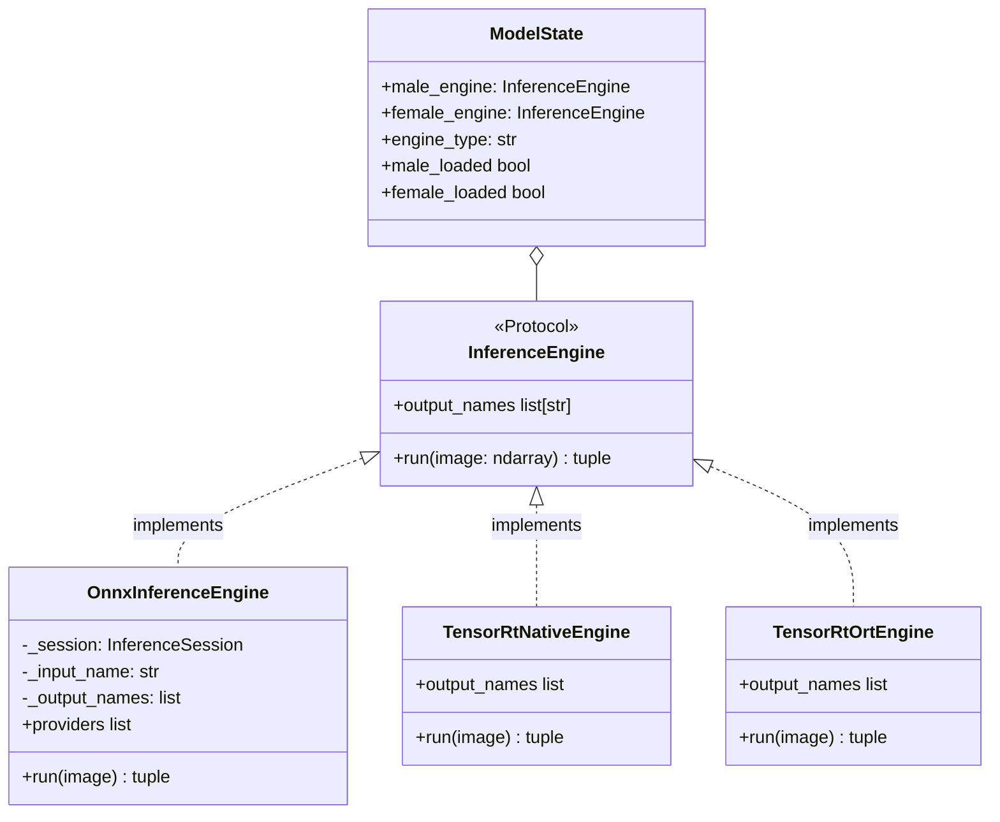

# 🧠 AI Server 구조 분석 리포트

> 작성일: 2026-03-25  
> 분석 대상: `ai-server/src/` (FastAPI + ONNX/TensorRT 추론 서버)

---

## 1. 디렉터리 구조

```
ai-server/
├── src/
│   ├── main.py              ← FastAPI 앱 팩토리 (진입점)
│   ├── config.py            ← 모든 하이퍼파라미터 중앙 관리
│   ├── routes/
│   │   ├── health.py        ← GET /health (서버 상태 확인)
│   │   └── analyze.py       ← POST /analyze (핵심: 이미지 → 결과)
│   ├── core/                ← AI 도메인 로직
│   │   ├── model.py         ← HFDClassifier (EfficientNet-B2 + 4 Heads)
│   │   ├── preprocessing.py ← 이미지 → 텐서 변환 파이프라인
│   │   ├── augmentation.py  ← 학습/추론용 이미지 변환
│   │   ├── iq_scorer.py     ← 원점수 → IQ + 백분위 계산
│   │   ├── item_mapping.py  ← 60문항 번호 매핑 테이블
│   │   └── onnx_converter.py← PyTorch → ONNX 변환 스크립트
│   └── infra/               ← 인프라/시스템 계층
│       ├── engine_protocol.py   ← InferenceEngine Protocol (공통 인터페이스)
│       ├── model_loader.py      ← TensorRT → ONNX Fallback 로더
│       ├── onnx_inference.py    ← ONNX Runtime 엔진
│       ├── tensorrt_engine.py   ← TensorRT Native 엔진 (GPU 최적화)
│       ├── tensorrt_ort_engine.py ← TensorRT + ORT 혼합 엔진
│       └── logger.py            ← structlog 기반 JSON 로거
└── tests/
    ├── test_model_architecture.py ← L1: Shape 검증
    ├── test_preprocessing.py      ← L1/L2: 전처리 검증
    ├── test_inference.py          ← L2: 동결/추론 검증
    ├── test_health.py             ← L3: Graceful Degradation
    └── test_e2e_real_image.py     ← E2E: 실제 이미지 통합
```

---

## 2. HTTP 요청 처리 흐름 (POST /analyze)



---

## 3. 서버 부팅 시 엔진 로딩 전략 (Fallback Chain)



> **핵심**: 모델 파일이 없어도 서버는 **절대 죽지 않습니다**. `/health`는 항상 200 OK를 반환하고, `/analyze` 호출 시에만 503을 반환합니다. (Graceful Degradation)

---

## 4. 추론 엔진 계층 구조 (Strategy Pattern)



> **핵심**: `analyze.py`는 `engine.run(img_np)` 한 줄만 호출합니다. 엔진이 ONNX든 TensorRT든 **동일 인터페이스**이므로 라우터 코드는 전혀 바뀌지 않습니다. (Protocol 기반 duck typing)

---

## 5. 데이터 변환 흐름 요약

```
[클라이언트 이미지 bytes]
       │  (multipart/form-data)
       ▼
[_validate_image_file()]
  ✓ 0바이트 거부
  ✓ Content-Type 허용 목록
  ✓ 매직 바이트 (JPEG/PNG/BMP/WebP)
  ✓ PIL.verify() 이중 검증
       │
       ▼
[PIL Image.open().convert("RGB")]
       │
       ▼
[get_val_transform(260)]
  Resize(260, 260)
  ToTensor  → [0.0, 1.0] float32
  Normalize → 채널별 ImageNet 통계 적용
       │ Tensor shape: (1, 3, 260, 260)
       ▼
[engine.run(img_np)]
  EfficientNet-B2 Backbone (frozen)
  → GlobalAvgPool → flatten → [1408]
  → head_a: Linear(1408→19)  ← 머리/얼굴
  → head_b: Linear(1408→14)  ← 몸통/비례
  → head_c: Linear(1408→16)  ← 사지/말단
  → head_d: Linear(1408→11)  ← 의복/질적
       │ Raw Logits: (1,19), (1,14), (1,16), (1,11)
       ▼
[_logits_to_item_results()]
  Sigmoid 적용 → 확률
  ≥ 0.5 → 1 (통과), < 0.5 → 0 (미통과)
       │ 60문항 dict {"1": 1, "2": 0, ...}
       ▼
[score_to_result()]
  raw_score = sum(items)  ← 0~60점
  IQ = 100 + 15 × ((점수 - M) / SD)  ← 전국 규준
  백분위 = IQ_TO_PERCENTILE[iq]
       │
       ▼
[최종 JSON 응답]
  items: {60문항 결과}
  head_scores: {a,b,c,d 원점수}
  raw_score, iq, percentile
  child_info: {age, child_gender, figure_gender}
```

---

## 6. 현재 구현 상태 요약표

| 컴포넌트 | 파일 | 상태 | 역할 |
|:---|:---|:---:|:---|
| FastAPI 앱 진입점 | `src/main.py` | ✅ | 앱 팩토리, 라우터 등록 |
| 설정 중앙 관리 | `src/config.py` | ✅ | 하이퍼파라미터 하드코딩 방지 |
| 이미지 분석 API | `src/routes/analyze.py` | ✅ | 입력 검증 + 추론 + IQ 산출 |
| 헬스 체크 API | `src/routes/health.py` | ✅ | CPU/메모리/모델 상태 반환 |
| HFD 모델 | `src/core/model.py` | ✅ | EfficientNet-B2 + 4 Linear Heads |
| 전처리 파이프라인 | `src/core/preprocessing.py` | ✅ | Resize → ToTensor → Normalize |
| IQ 점수 계산 | `src/core/iq_scorer.py` | ✅ | 전국 규준 기반 IQ + 백분위 |
| 엔진 공통 인터페이스 | `src/infra/engine_protocol.py` | ✅ | Protocol (duck typing) |
| ONNX 추론 엔진 | `src/infra/onnx_inference.py` | ✅ | CPU 기본 추론 |
| TensorRT 엔진 | `src/infra/tensorrt_engine.py` | ✅ | GPU 최적화 추론 |
| 모델 로더 | `src/infra/model_loader.py` | ✅ | TRT → ONNX Fallback 전략 |
| 구조화 로거 | `src/infra/logger.py` | ✅ | structlog JSON 포맷 |
| ONNX 변환기 | `src/core/onnx_converter.py` | ✅ | PyTorch → ONNX 스크립트 |
