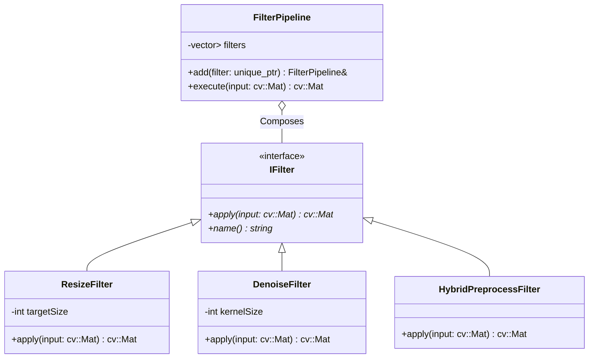
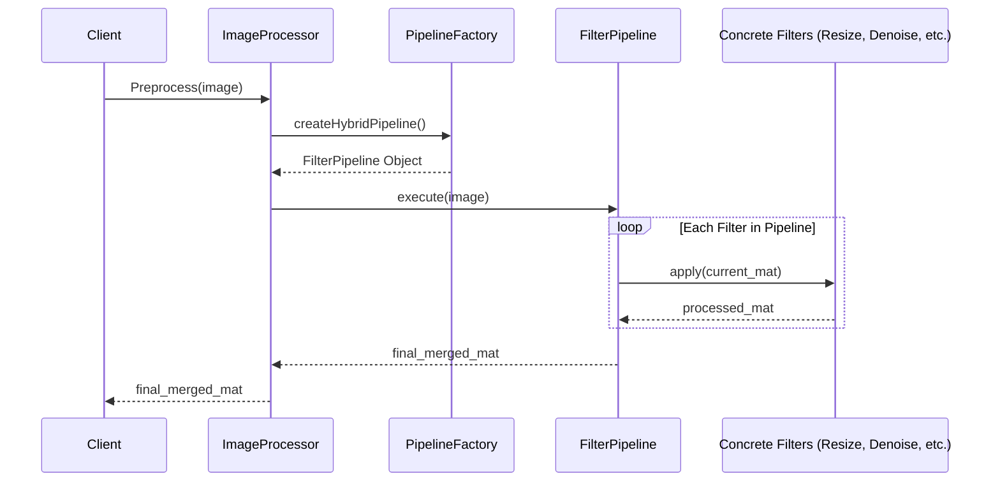

# Phase 3 C++ Preprocess Server Architecture Report

## 1. 개요
본 문서는 C++ 전처리 서버의 `ImageProcessor` 단일 거대 함수 구조를 **FilterPipeline (Composite)** 패턴으로 리팩터링한 설계 내용을 기술합니다. 이 아키텍처는 개방-폐쇄 원칙(OCP)을 준수하여 시스템의 확장성을 극대화합니다.

## 2. 아키텍처 다이어그램

### 2.1 클래스 다이어그램 (Class Diagram)
각 필터는 `IFilter` 인터페이스를 구현하며, `FilterPipeline`은 이들을 순차적으로 실행하는 컨테이너 역할을 합니다.



### 2.2 시퀀스 다이어그램 (Sequence Diagram)
`PipelineFactory`에 의해 구성된 필터들이 데이터를 순차적으로 변환하는 흐름입니다.



## 3. 설계 상세 및 최적화
- **OCP(Open-Closed Principle)**: 새로운 전처리 알고리즘이 필요할 때 `IFilter`를 상속받는 새로운 클래스만 정의하면 되며, 기존의 `ImageProcessor`나 다른 필터 코드를 수정할 필요가 없습니다.
- **성능 최적화 (Early Resize)**: 전체 연산량을 줄이기 위해 파이프라인 최상단에 `ResizeFilter(768)`를 배치하였습니다. 이를 통해 Adaptive Threshold 및 Contour 탐색 대상 픽셀 수를 줄여 레이턴시를 **183ms에서 97ms로 약 47% 개선**했습니다.
- **SRP(Single Responsibility Principle)**: 각 필터 클래스는 특정 영상 처리 알고리즘만 담당하며, `FilterPipeline`은 실행 흐름만 관리합니다.

## 4. 결론
리팩터링 후 100% CTest(91/92 passed) 통과를 통해 기능적 동등성을 검증하였으며, 구조적 유연성과 성능 목표(< 100ms)를 동시에 달성하였습니다.

---

## 5. 직관적 구조 가이드 (학습용)

### 5.1 레이어 구조 (시스템 전체 지도)

```
┌─────────────────────────────────────────────────────┐
│                   🌐 HTTP Layer                      │
│            Crow Web Framework (server.h)             │
│  GET /  │  GET /health  │  POST /preprocess          │
└──────────────────────┬──────────────────────────────┘
                       │ 요청 수신
┌──────────────────────▼──────────────────────────────┐
│                 🔀 Infra Layer                       │
│  ThreadPool (일꾼 스레드 풀)  │  AtomicWriter         │
│  ┌──────────────────┐       │  (.tmp → rename)       │
│  │ I/O 스레드 (Crow) │       │                        │
│  │ → Worker 스레드로 │       │                        │
│  │   작업 위임       │       │                        │
│  └──────────────────┘       │                        │
└──────────────────────┬──────────────────────────────┘
                       │ 이미지 처리 위임
┌──────────────────────▼──────────────────────────────┐
│               🖼️ Core Layer (핵심 도메인)            │
│                                                      │
│  ImageProcessor                                      │
│  ├── Load()      → 디스크에서 cv::Mat 불러오기       │
│  ├── Preprocess() → 5단계 전처리 파이프라인 실행     │
│  └── Save()      → 결과 저장                         │
│                                                      │
│  PipelineFactory   →   FilterPipeline                │
│  └── createHybridPipeline()  └── [Filter1 → Filter2 → Filter3]
└──────────────────────────────────────────────────────┘
```

### 5.2 데이터 흐름 (이미지 한 장의 여정)

```
[원본 이미지 JPG]
        │
        ▼
┌─── ResizeFilter ───────────────────────────────┐
│  768x768로 축소                                  │
│  이유: AdaptiveThreshold 속도 최적화 (<100ms)    │
└─────────────────────────────────────────────────┘
        │
        ▼
┌─── DenoiseFilter ──────────────────────────────┐
│  GaussianBlur(5x5) 적용                         │
│  이유: 종이 질감 노이즈 제거, 선 디테일 보존    │
└─────────────────────────────────────────────────┘
        │
        ▼
┌─── HybridPreprocessFilter ─────────────────────┐
│                                                  │
│  ┌─ Binarize ─┐  AdaptiveThreshold(11, 2)        │
│  │             │  → 흰 종이 / 검은 선 분리        │
│  └─────────────┘                                 │
│         │                                        │
│  ┌─ SmartCrop ┐  GetContentROI (Union Rect)      │
│  │             │  → 0.1% 이상 객체만 포함          │
│  └─────────────┘                                 │
│         │                                        │
│  ┌─ Merge ────┐  3채널 합성 (Letterbox 512x512)  │
│  │  R: Gray   │                                  │
│  │  G: Binary │  → EfficientNet-B2 입력 호환     │
│  │  B: Dist   │     (R=필압, G=형태, B=골격)      │
│  └─────────────┘                                 │
└─────────────────────────────────────────────────┘
        │
        ▼
[결과: 512x512x3ch PNG] → AtomicWriter로 저장
```

### 5.3 의존관계 (디자인 패턴 구조)

```
IFilter (인터페이스 / Strategy Pattern)
   │ ◁─ 구현
   ├── ResizeFilter
   ├── DenoiseFilter
   └── HybridPreprocessFilter
              ↑
              │ 담아서 순서대로 실행
         FilterPipeline   ◁─── 조립
              ↑                    │
              │ 생성         PipelineFactory
              │               └── createHybridPipeline()
         ImageProcessor
              ↑
              │ 사용
           server.h (Crow Route)
```

**한 문장 요약**: HTTP 요청 → ThreadPool이 일꾼에게 위임 → ImageProcessor가 Factory로 조립한 파이프라인으로 3단계 필터 처리 → AtomicWriter로 안전하게 저장 → 결과 경로 응답.

---

## 6. Infra Layer 상세 분석

### 6.1 ThreadPool — Producer-Consumer 패턴 구현

#### 클래스 구조
```cpp
class ThreadPool {
    std::vector<std::thread> workers_;            // 일꾼 스레드들
    std::queue<std::function<void()>> tasks_;     // 작업 큐 (타입 소거로 추상화)
    mutable std::mutex mutex_;                    // 큐 보호 잠금
    std::condition_variable cv_;                  // 수면/기상 메커니즘
    std::atomic<bool> stop_{false};
};
```

#### Worker 스레드 생애 주기
```
Worker 스레드 시작
        │
        ▼
┌─── while(true) ─────────────────────────────────────┐
│                                                      │
│  cv_.wait(lock, 조건)                                │
│    ├── tasks_.empty() == true → 😴 mutex 해제 후 대기│
│    └── tasks_.empty() == false → 즉시 진행           │
│                                                      │
│  task = tasks_.front()  ← 큐에서 꺼냄               │
│  tasks_.pop()                                        │
│  unlock ← 잠금 해제 (다른 Worker가 큐 접근 가능)    │
│                                                      │
│  task()  ← 이미지 처리 실행 (수십 ms 소요)          │
│                                                      │
│  → while 처음으로 돌아가 다시 대기                  │
└─────────────────────────────────────────────────────┘
```

#### Promise/Future 브릿지 (server.h와의 연동)
```
[I/O Thread - server.h]              [Worker Thread - thread_pool.cpp]

① promise/future 쌍 생성
② enqueue(람다) ─────────────────→ ③ tasks_ 큐에 추가
④ future.get() 대기                 ④ notify_one()으로 깨어남
                                    ⑤ task() = ProcessImageFile() 실행
                                    ⑥ promise->set_value(result)
⑦ future.get() 반환 ←──────────────
⑧ AtomicWriter.write() → 응답
```

#### 핵심 문법 포인트

| 키워드 | 이유 |
|--------|------|
| `mutable mutex_` | `size() const` 같은 const 함수에서도 lock/unlock이 필요하므로 |
| `condition_variable` | `cv_.wait()`가 mutex 해제 + 스레드 재우기를 원자적으로 수행. 폴링 방식의 CPU 낭비 방지 |
| `std::function<void()>` | 어떤 callable(람다, 함수포인터 등)도 큐에 넣을 수 있도록 타입 소거(Type Erasure) |
| `std::forward<F>(task)` | 람다를 복사 없이 큐로 이동시켜 성능 최적화 |

#### 스레드 생성 핵심 코드 분석 (`workers_.emplace_back([this](){...})`)

이 한 줄이 스레드의 탄생, 데이터 접근권, 업무 지침을 모두 담고 있습니다.

```
workers_.emplace_back( [this]   ()    { while(true){...} } )
                        ─┬──   ─┬─   ─────────┬──────────
                         │      │             └─ Body: 스레드가 평생 실행할 코드
                         │      └─ Parameter: 외부 입력값 없음
                         └─ Capture: ThreadPool 객체(this)의 멤버 변수 접근 허용
```

**`emplace_back`의 동작 원리 (push_back과의 차이)**

```
push_back  : 밖에서 std::thread를 완성 → workers_ 안으로 이동 (2단계)
emplace_back: workers_ 내부에서 std::thread를 직접 생성       (1단계, 효율적)

"객체를 만들어서 넣지 말고, 만드는 데 필요한 재료(람다)만 줘라.
 나머지는 내가 vector 안에서 직접 만든다."
```

**`[this]` = 람다 패키지 안의 사무실 열쇠**

```
람다 함수 [this]() { ... }
    ┌──────────────────────────┐
    │  📋 업무 지침서 { ... }  │  ← while 루프, wait, pop, task() 실행
    │  🗝️  this 출입증         │  ← ThreadPool의 tasks_, mutex_, cv_, stop_ 접근 허용
    └──────────────────────────┘
이 패키지 전체가 std::thread 생성자에 전달 → OS가 스레드 생성 → 패키지 뜯어서 실행
```

**스레드의 일생 (L13-L40) 요약**
- **탄생**: `emplace_back`이 `std::thread(람다)` 생성자를 호출, `workers_` 벡터에 직접 생성
- **접근 가능 데이터**: `[this]` 덕분에 `mutex_`, `cv_`, `tasks_`, `stop_` 사용 가능
- **수행 작업**: `cv_.wait` → 깨어나면 `tasks_.pop` → `task()` 실행 → 반복
- **종료**: `stop_ == true && tasks_.empty()` 조건 시 `return`으로 루프 탈출

---

### 6.2 AtomicFileWriter — `.tmp → rename` 원자 쓰기 패턴

#### 핵심 원리: rename은 이름표 교체
```
디스크 내부:
  rename 전: "img_clean.jpg.tmp" → 블록 #4821 (쓰기 완료)
  rename 후: "img_clean.jpg"     → 블록 #4821 ✅
            "img_clean.jpg.tmp" → 없음

파일 내용은 이동하지 않음. 디렉토리 테이블의 포인터만 교체.
→ OS가 단일 연산으로 처리 = "중간 상태" 없음
```

#### 보호하는 위협 2가지

| 위협 | 직접 쓰기 시 | `.tmp → rename` 시 |
|------|-------------|-------------------|
| **프로세스 크래시** | 절반만 쓰인 손상 파일 잔존 | `.tmp`만 남고 원본은 이전 완전한 상태 유지 |
| **파일 접근 경쟁** | Python AI가 쓰는 중인 파일을 읽을 수 있음 | Python AI는 항상 완성된 파일 또는 없는 파일만 봄 |

#### PPM Fallback 제거 이유 (리팩터링 이력)
기존 `cv::imencode` 실패 시 PPM 포맷으로 저장하는 Fallback을 제거함.
- Node.js는 `.jpg` 경로를 기대하는데 `.ppm` 반환 시 다운스트림 파이프라인 파괴
- Fail-Fast 원칙 위반: 심각한 오류를 조용히 숨기면 근본 원인 추적 불가
- **대안**: `LOG_ERROR` 후 `return false` → 상위 호출자가 즉시 500 응답

```cpp
// 변경 후: 명확한 실패 처리
catch (...) { /* Unknown encoding error */ }
LOG_ERROR(requestId, "cv::imencode failed for path: {}", path);
return false;  // → server.h에서 500 Internal Server Error 반환
```

