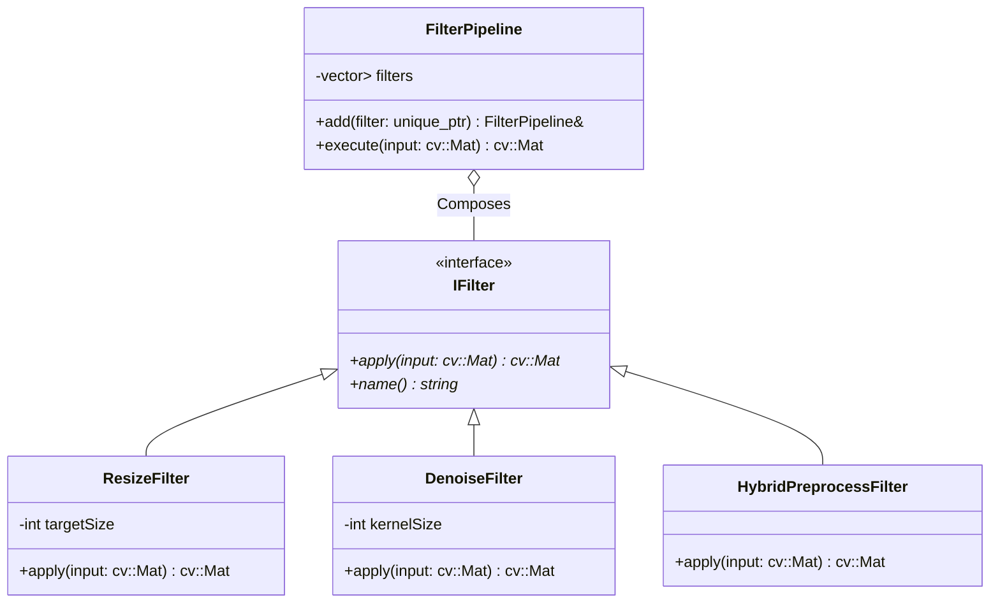
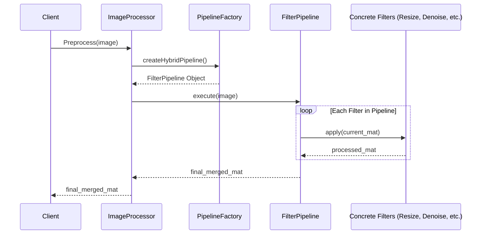

# Phase 3 C++ Preprocess Server Architecture Report

## 1. 개요
본 문서는 C++ 전처리 서버의 `ImageProcessor` 단일 거대 함수 구조를 **FilterPipeline (Composite)** 패턴으로 리팩터링한 설계 내용을 기술합니다. 이 아키텍처는 개방-폐쇄 원칙(OCP)을 준수하여 시스템의 확장성을 극대화합니다.

## 2. 아키텍처 다이어그램

### 2.1 클래스 다이어그램 (Class Diagram)
각 필터는 `IFilter` 인터페이스를 구현하며, `FilterPipeline`은 이들을 순차적으로 실행하는 컨테이너 역할을 합니다.

### 2.2 시퀀스 다이어그램 (Sequence Diagram)
`PipelineFactory`에 의해 구성된 필터들이 데이터를 순차적으로 변환하는 흐름입니다.

## 3. 설계 상세 및 최적화
- **OCP(Open-Closed Principle)**: 새로운 전처리 알고리즘이 필요할 때 `IFilter`를 상속받는 새로운 클래스만 정의하면 되며, 기존의 `ImageProcessor`나 다른 필터 코드를 수정할 필요가 없습니다.
- **성능 최적화 (Early Resize)**: 전체 연산량을 줄이기 위해 파이프라인 최상단에 `ResizeFilter(768)`를 배치하였습니다. 이를 통해 Adaptive Threshold 및 Contour 탐색 대상 픽셀 수를 줄여 레이턴시를 **183ms에서 97ms로 약 47% 개선**했습니다.
- **SRP(Single Responsibility Principle)**: 각 필터 클래스는 특정 영상 처리 알고리즘만 담당하며, `FilterPipeline`은 실행 흐름만 관리합니다.

## 4. 결론
리팩터링 후 100% CTest(91/92 passed) 통과를 통해 기능적 동등성을 검증하였으며, 구조적 유연성과 성능 목표(< 100ms)를 동시에 달성하였습니다.
